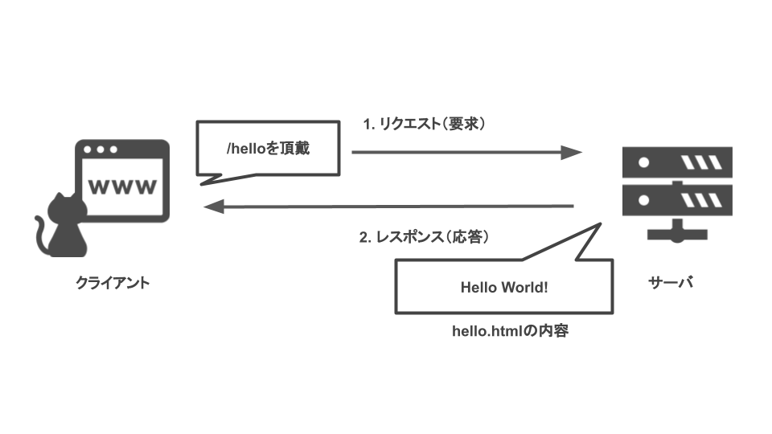

# 簡単な Web サイト

このページでは最低限の Web サーバを実装します。

**作る Web サイト：** `/hello` にアクセスしたときに、Hello, World!が返ってくる Web サイト


## ソースコード

```python3
from flask import Flask
app = Flask(__name__)

@app.route("/hello")
def index():
    # /hello にアクセスした
    # ときここが呼ばれる
    return "Hello World!"

if __name__ == "__main__":
    # サーバ立ち上げ
    app.run(
        host="0.0.0.0",
        port=5001)

```

## 実行方法

```sh
# 実行するパス：/code/1
python3 serv.py
```

[ここ](http://localhost:5001)からサイトにアクセスできます。
